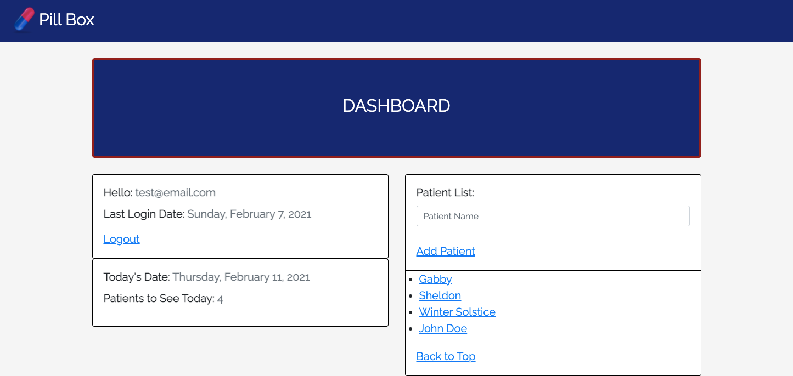
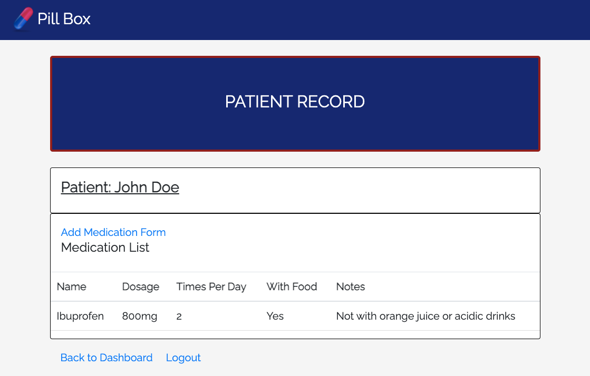
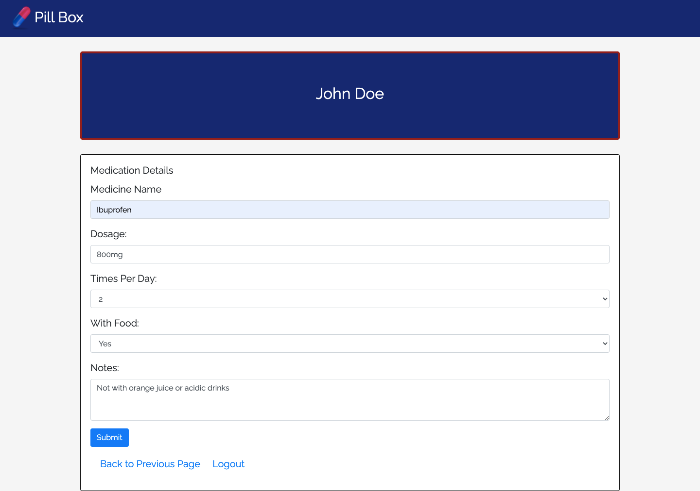

# Pill-Box

## Description

Pill Box is an application designed to help caregivers efficiently manage the medications their patients need to take. It is a full stack, Heroku deployed, mobile-responsive, secure application that requires the caregivers to register and log in to manage their patient's medication intake, stay organized and reduce errors.

## Table of Contents

* [Technologies](#technologies)
* [Usage](#usage)
* [Credits](#credits)
* [Resources](#resources)
* [Articles/References](#articles/references)
* [Questions](#questions)
* [Contributing](#contributing)
* [License](#license)

## Technologies
* Bootstrap 4
* JavaScript
* jQuery
* Node.js (Passport, Bcyrpt, Sequlize, Express, ESLint)
* Handlebars
* MySQL
* Travis CI

## Usage

URL - https://arcane-earth-49085.herokuapp.com/

The application is built to help caregivers efficiently manage and administer any medication their patients need to take on a daily basis.

If the caregiver is not already registered, the sign up link can be clicked and the caregiver will be taken to the page to register. The screenshot below will show the page where caregivers can register.

Once the caregiver logs in, the dashboard page is displayed. The dashboard includes a welcome section showing the current caregiver's email address, the date of their last login, and the option to log out. It also shows the caregiver the current date and the number of patients to see. Last but not least is the patient list section which includes the option for the caregiver to add a new patient, the list of existing patients, and an option to go back to the top of the page. Below is a screenshot of the dashboard page.

The caregiver has an option to click on any of the existing patients to see the list of medication for that particular patient and to add new medication. The caregiver also has the option to click back to dashboard to return to the previous page or to click log out. Below is a screenshot of the patient record page.

If the caregiver clicks on the option to add new medication, the page with the form to enter all the information for the medication is displayed. The caregiver will have the option to enter the medicine name, the dosage, the times per day, whether or not to take it with food, and to add any notes. Once the caregiver clicks the submit button, the site goes back to the patient record page and it shows the new medication that was just added. The caregiver also has the option to go back to previous page and to log out. Below is a screenshot of the page to add medication.

When the user logs out, the log in page is displayed to give the user the option to log back in.

## Credits

This application was built in collaboration with:
* Jose Garcia - https://github.com/chavalk
* Jason McDonald - https://github.com/JasonMcD96

## Resources

* npmjs.com
* mysql.com
* getboostrap.com
* handlebarsjs.com
* travis-ci.org

## Articles/References

* https://www.caregiver.org/caregiver-statistics-demographics
* https://www.cdc.gov/nchs/fastats/drug-use-therapeutic.htm
* https://psnet.ahrq.gov/primer/medication-administration-errors

## Contributing

Do you have a suggestion or feature you'd like to add? 
Contributions are welcome and appreciated. Visit https://github.com/ggfalloon/Pill and create a pull request.

## Questions

&copy; Gabriele Falloon, https://github.com/ggfalloon, ggfalloon@gmail.com
&copy; Jose Garcia, https://github.com/chavalk, chavalk@hotmail.com
&copy; Jason McDonald, https://github.com/JasonMcD96, jasonmcd65@gmail.com

## License

License TBD