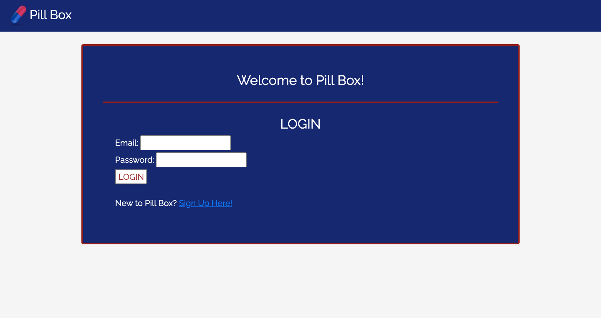
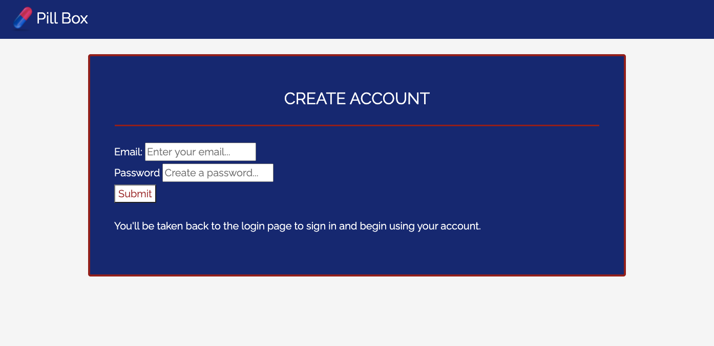

# Pill-Box

## Description

Pill Box is an application designed to help caregivers efficiently manage the medications their patients need to take. It is a full stack, Heroku deployed, mobile-responsive, secure application that requires the user to register and log in, add and update patients and their medications so they can stay organized and reduce errors.

## Table of Contents

* [Technologies](#technologies)
* [Usage](#usage)
* [Credits](#credits)
* [Resources](#resources)
* [Articles/References](#articles/references)
* [Questions](#questions)
* [Contributing](#contributing)
* [License](#license)

## Technologies
* Bootstrap 4
* JavaScript
* jQuery
* Node.js (Passport, Bcyrpt, Sequlize, Express, ESLint)
* Handlebars
* MySQL
* Travis CI

## Usage

URL - https://sheltered-caverns-06883.herokuapp.com/

If the user is not already registered, the sign up link can be clicked and they will be taken to the page to register. 

Once the user logs in, the dashboard page is displayed. It will include a welcome section showing the user's email address, the date of their last login, number of patients to see. out. In the box to the right the user can add a patient and view all current patients.

By clicking on the patient's name link in the patient list, the user can view that patient's record and add medcication to their record.

When the user adds medication to the patient's record, they are provided a form to complete the dosage, the times per day, whether or not to take it with food, and to add any notes. By hitting submit, the user adds that medication to the patient's record. Then they can click the "Back to Previous Page" buton to return to the patient record, view other records or logout.

## Credits

This application was built in collaboration with:
* Jose Garcia - https://github.com/chavalk
* Jason McDonald - https://github.com/JasonMcD96

## Resources

* npmjs.com
* mysql.com
* getboostrap.com
* handlebarsjs.com
* travis-ci.org

## Articles/References

* https://www.caregiver.org/caregiver-statistics-demographics
* https://www.cdc.gov/nchs/fastats/drug-use-therapeutic.htm
* https://psnet.ahrq.gov/primer/medication-administration-errors

## Contributing

Do you have a suggestion or feature you'd like to add? 
Contributions are welcome and appreciated. Visit https://github.com/ggfalloon/Pill-Box and create a pull request.

## Questions

&copy; Gabriele Falloon, https://github.com/ggfalloon, ggfalloon@gmail.com
&copy; Jose Garcia, https://github.com/chavalk, chavalk@hotmail.com
&copy; Jason McDonald, https://github.com/JasonMcD96, jasonmcd65@gmail.com

## License

License TBD